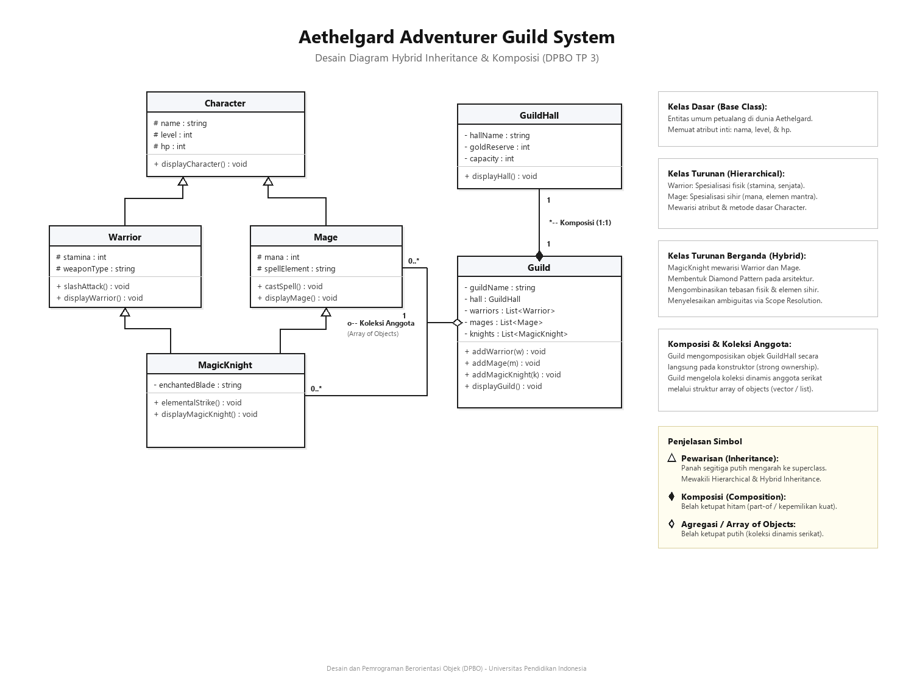
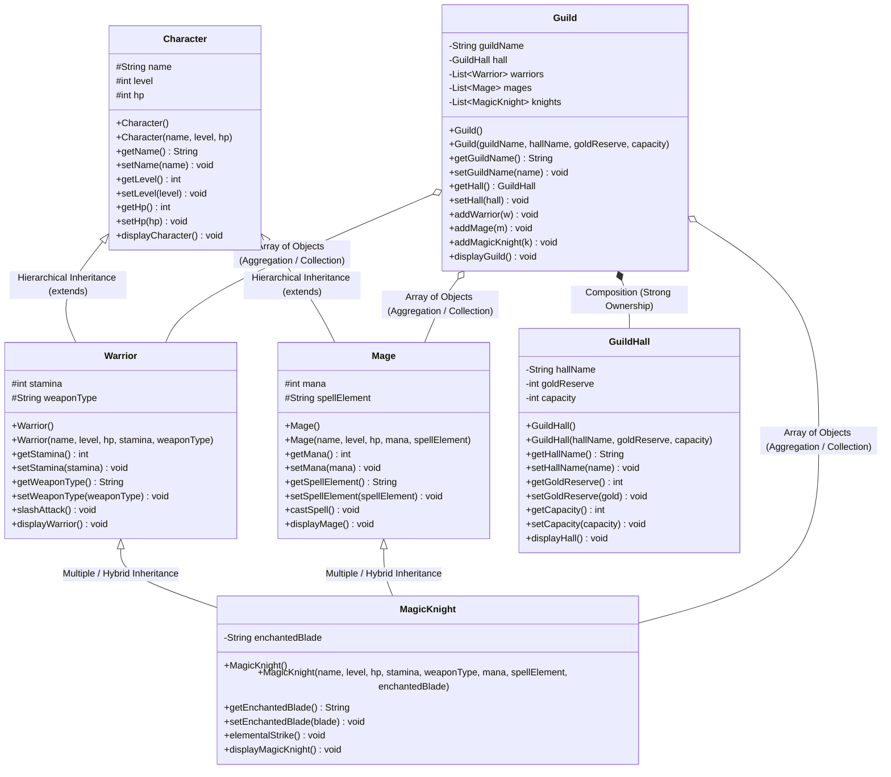
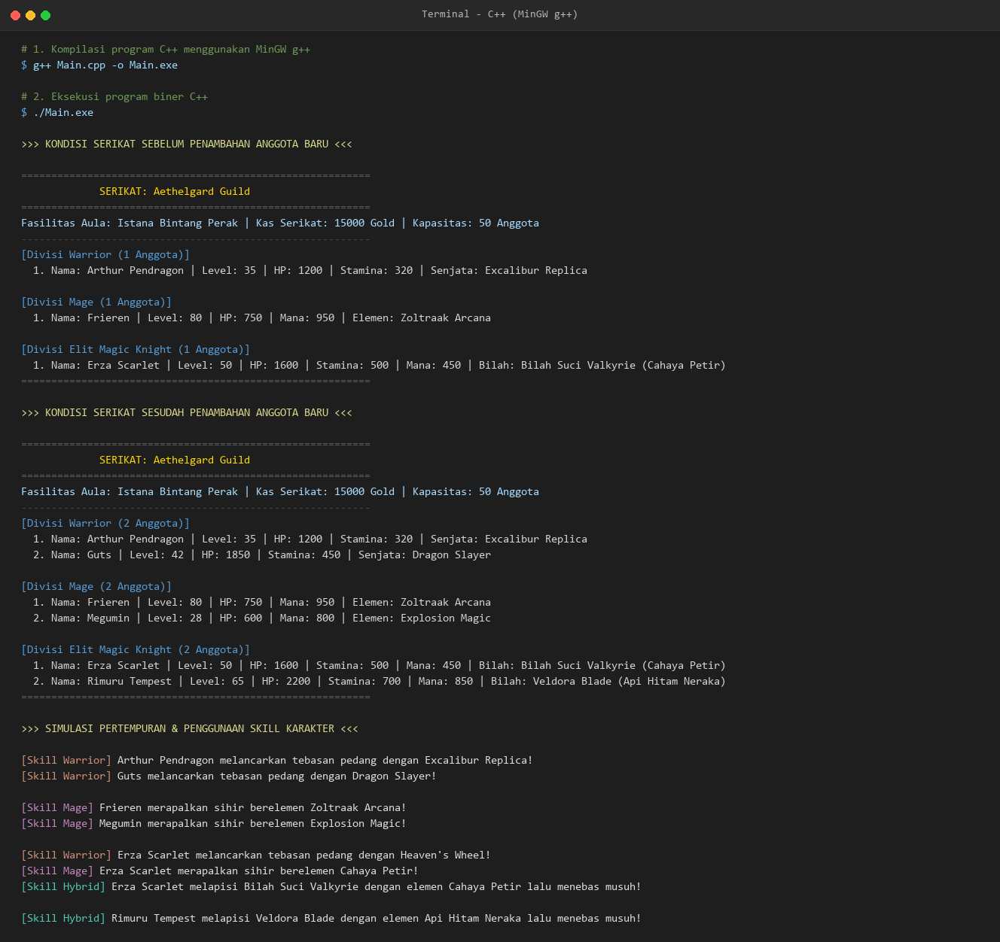
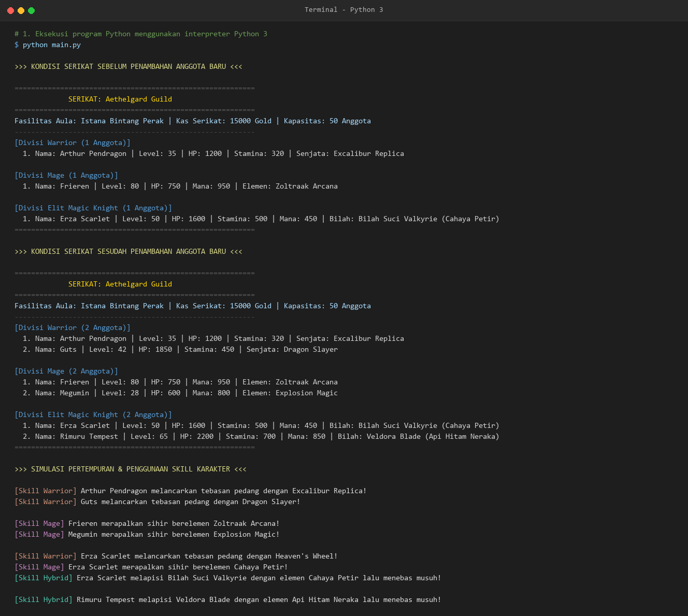
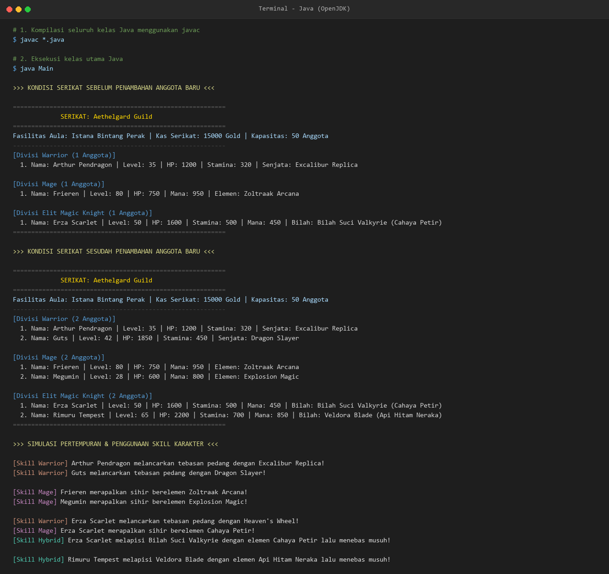

# TP3 DPBO 2025/2026 - Hybrid Inheritance & Composition: Sistem Serikat Petualang (JRPG)

Tugas Praktikum 3 mata kuliah Desain dan Pemrograman Berorientasi Objek (DPBO), Program Studi Ilmu Komputer, Universitas Pendidikan Indonesia, semester genap 2025/2026.

---

## Janji Kejujuran Akademik

Saya Devindra Azra Dwi Putra dengan NIM 2509003 mengerjakan TP 3 dalam mata kuliah DPBO untuk keberkahanNya maka saya tidak melakukan kecurangan seperti yang telah dispesifikasikan. Aamiin.

---

## Deskripsi Singkat

Halo! Di Tugas Praktikum 3 (TP 3) DPBO ini, tema yang aku angkat adalah **Aethelgard Adventurer Guild System** yang terinspirasi dari game RPG dan anime fantasi. 

Program ini mensimulasikan sistem markas serikat petualang (*adventurer guild*). Di sini kita mengelola fasilitas aula serikat, kas keuangan, sampai manajemen anggota petualang dari divisi kelas tempur yang berbeda-beda.

Semua spesifikasi dan pilar penugasan praktikum Modul 06 (Inheritance Lanjutan & Relasi Antarkelas) sudah diterapkan secara lengkap:
1. **Minimal 4 Kelas Berbasis OOP**: Di sini ada total **6 kelas** utama (`Character`, `Warrior`, `Mage`, `MagicKnight`, `GuildHall`, dan `Guild`) ditambah 1 interface (`MageRole`) khusus untuk Java.
2. **Composition (Komposisi)**: Kelas `Guild` punya relasi kepemilikan kuat (*strong ownership*) dengan `GuildHall`. Jadi objek aula dibuat langsung di dalam konstruktor kelas `Guild`—artinya aula ini melekat erat dengan masa hidup serikatnya.
3. **Array of Objects**: Pengelolaan daftar anggota petualang di setiap divisi dilakukan secara dinamis menggunakan koleksi objek (`std::vector` di C++, `list` di Python, dan `ArrayList` di Java).
4. **Inheritance Lanjutan (Hybrid Inheritance & Diamond Problem)**: Hierarki petualang menggabungkan *Hierarchical* dan *Multiple Inheritance*, membentuk pola belah ketupat (*diamond pattern*): `Character` $\rightarrow$ `Warrior` & `Mage` $\rightarrow$ `MagicKnight`.
5. **Full 3 Bahasa**: Program diimplementasikan lengkap di tiga bahasa sekaligus, yaitu **C++**, **Python**, dan **Java** (buat bonus nilai maksimal).

---

## Desain Kelas dan Relasi

Arsitektur relasi antarkelas dirancang seperti ini:

```text
       [ Character ] (Base Class)
          ▲       ▲
          │       │  (Hierarchical Inheritance)
  ┌───────┴───┐ ┌─┴─────────┐
  │  Warrior  │ │   Mage    │
  └───────┬───┘ └─┬─────────┘
          ▲       ▲
          │       │  (Multiple Inheritance / Diamond Pattern)
      [ MagicKnight ]
             ▲
             : (Array of Objects)
  [ GuildHall ] <*-- [ Guild ]
  (Komponen)          (Komposit)
```

### 1. Kelas Dasar: `Character`
Kelas induk paling dasar (*base class*) yang menyimpan data umum setiap petualang di dunia Aethelgard.
- **Atribut**:
  - `name`: Nama lengkap petualang.
  - `level`: Level / tingkat kekuatan petualang.
  - `hp`: *Hit Points* (daya tahan / darah petualang).
- **Metode**: Default constructor, constructor berparameter, getter & setter, serta metode `displayCharacter()`.

### 2. Kelas Turunan 1: `Warrior` (turunan dari `Character`)
Spesialis petualang lini depan yang mengandalkan fisik dan senjata tajam (*is-a Character*).
- **Atribut Tambahan**:
  - `stamina`: Energi buat melancarkan serangan fisik.
  - `weaponType`: Senjata yang dipakai (contoh: *Excalibur Replica*, *Dragon Slayer*).
- **Metode**: Constructor berparameter (delegasi ke kelas induk), getter & setter, aksi tebasan `slashAttack()`, dan `displayWarrior()`.

### 3. Kelas Turunan 2: `Mage` (turunan dari `Character`)
Spesialis lini belakang yang fokus pada manipulasi mana dan sihir elemen (*is-a Character*).
- **Atribut Tambahan**:
  - `mana`: Kapasitas energi magis buat merapalkan mantra.
  - `spellElement`: Elemen sihir andalan (contoh: *Zoltraak Arcana*, *Explosion Magic*).
- **Metode**: Constructor berparameter (delegasi ke kelas induk), getter & setter, aksi rapalan `castSpell()`, dan `displayMage()`.

### 4. Kelas Turunan Berganda: `MagicKnight` (turunan dari `Warrior` & `Mage`)
Kelas petualang elit hasil gabungan dua jalur (*Hybrid Inheritance*). Karakter ini bisa tebasan pedang fisik sekaligus mahir sihir elemen!
- **Atribut Tambahan**:
  - `enchantedBlade`: Pedang magis yang dialiri energi elemen (contoh: *Bilah Suci Valkyrie*, *Veldora Blade*).
- **Metode**: Constructor berparameter, getter & setter, jurus pamungkas kombinasi pedang & sihir `elementalStrike()`, serta `displayMagicKnight()`.

### 5. Kelas Komponen: `GuildHall`
Kelas yang merepresentasikan fasilitas fisik aula serikat.
- **Atribut**:
  - `hallName`: Nama aula serikat (contoh: *Istana Bintang Perak*).
  - `goldReserve`: Kas keuangan serikat (dalam satuan Gold).
  - `capacity`: Kapasitas maksimal kuota anggota.
- **Metode**: Default constructor, constructor berparameter, getter & setter, dan `displayHall()`.

### 6. Kelas Komposit: `Guild`
Kelas pengelola serikat yang menyatukan fasilitas aula dan seluruh anggota petualang.
- **Relasi Komposisi**: Objek `GuildHall` dibuat langsung di dalam konstruktor kelas `Guild`. Keberadaan aula terikat erat dengan siklus hidup serikatnya (*strong ownership*).
- **Relasi Array of Objects**: Menyimpan daftar petualang per divisi secara dinamis:
  - `vector<Warrior>` / `warriors`
  - `vector<Mage>` / `mages`
  - `vector<MagicKnight>` / `knights`
- **Metode**: Constructor, `addWarrior()`, `addMage()`, `addMagicKnight()`, getter & setter, serta `displayGuild()` untuk mencetak rekap status serikat secara lengkap.

---

## Design Diagram (UML Class Diagram)

Ini diagram visual arsitektur relasi kelas, pola pewarisan *Hybrid Inheritance*, dan relasi *Composition* sesuai standar UML:



Versi diagram kelas dalam format Mermaid:


---

## Solusi Diamond Problem & Multiple Inheritance di 3 Bahasa

Karena pola belah ketupat (*Diamond Pattern*) ini punya karakteristik dan aturan sintaks yang berbeda di masing-masing bahasa, berikut cara penanganannya sesuai modul perkuliahan DPBO:

1. **Bahasa C++**:
   - Di C++, kelas `MagicKnight` mewarisi `Warrior` dan `Mage` secara berganda (`class MagicKnight : public Warrior, public Mage`).
   - Karena `Warrior` dan `Mage` sama-sama turunan dari `Character`, sempat muncul ambiguitas duplikasi pada atribut `name`, `level`, dan `hp`.
   - Mengikuti materi Slide 17 `Inheritance Lanjutan.pdf`, masalah ini diselesaikan dengan **Scope Resolution Operator** (misalnya `Warrior::name`, `Warrior::level`, `Warrior::hp`) saat mengakses atribut kakek dari dalam `MagicKnight`.
2. **Bahasa Python**:
   - Python dari sananya sudah mendukung *Multiple Inheritance* langsung (`class MagicKnight(Warrior, Mage)`).
   - Inisialisasi atributnya cukup memanggil konstruktor kedua kelas induk secara eksplisit:
     ```python
     Warrior.__init__(self, name, level, hp, stamina, weapon_type)
     Mage.__init__(self, name, level, hp, mana, spell_element)
     ```
   - Mekanisme MRO (*Method Resolution Order*) Python akan mengatur rantai hierarki pemanggilan secara otomatis dan konsisten.
3. **Bahasa Java**:
   - Java melarang keras pewarisan berganda antarkelas konkret (`class A extends B, C` bakal langsung error saat kompilasi).
   - Sesuai standar kurikulum DPBO (Modul 05 Polimorfisme & Interface serta Modul 06), solusinya adalah kombinasi **Single Inheritance + Interface**:
     ```java
     public class MagicKnight extends Warrior implements MageRole
     ```
   - Interface `MageRole` berfungsi sebagai kontrak kemampuan sihir (`castSpell()`, `getMana()`, `getSpellElement()`). Dengan begitu, `MagicKnight` tetap mewarisi fisik `Warrior` sekaligus mengadopsi peran magis layaknya `Mage`.

---

## Alur Program

Alur demo program di C++, Python, dan Java dibuat seragam:

1. **Inisialisasi Serikat**:
   - Membuat serikat `Aethelgard Guild` dengan aula `Istana Bintang Perak`, kas 15.000 Gold, dan kuota 50 anggota.
2. **Pendaftaran Anggota Awal**:
   - Divisi Warrior: *Arthur Pendragon* (Level 35, HP 1200, Stamina 320, senjata *Excalibur Replica*).
   - Divisi Mage: *Frieren* (Level 80, HP 750, Mana 950, sihir *Zoltraak Arcana*).
   - Divisi Magic Knight: *Erza Scarlet* (Level 50, HP 1600, Stamina 500, Mana 450, bilah *Bilah Suci Valkyrie - Cahaya Petir*).
3. **Cetak Kondisi SEBELUM Penambahan**:
   - Menampilkan status lengkap serikat, aula, dan daftar anggota awal ke terminal.
4. **Proses Penambahan Anggota Baru**:
   - Divisi Warrior: *Guts* (Level 42, HP 1850, Stamina 450, senjata *Dragon Slayer*).
   - Divisi Mage: *Megumin* (Level 28, HP 600, Mana 800, sihir *Explosion Magic*).
   - Divisi Magic Knight: *Rimuru Tempest* (Level 65, HP 2200, Stamina 700, Mana 850, bilah *Veldora Blade - Api Hitam Neraka*).
5. **Cetak Kondisi SESUDAH Penambahan**:
   - Menampilkan kembali laporan serikat yang sudah ter-update dengan total 6 petualang (2 petualang di tiap divisi).
6. **Simulasi Aksi & Skill Pertempuran**:
   - Menjalankan method aksi khas dari tiap kelas untuk membuktikan pewarisan fungsionalitas:
     - `slashAttack()` oleh para Warrior.
     - `castSpell()` oleh para Mage.
     - `slashAttack()`, `castSpell()`, dan skill kombinasi `elementalStrike()` oleh para Magic Knight.

---

## Struktur Folder

```text
TP3/
├── CPP/
│   └── Program/
│       ├── Character.cpp     # Kelas dasar Character
│       ├── Warrior.cpp       # Kelas turunan Warrior
│       ├── Mage.cpp          # Kelas turunan Mage
│       ├── MagicKnight.cpp   # Kelas turunan berganda MagicKnight
│       ├── GuildHall.cpp     # Kelas komponen GuildHall
│       ├── Guild.cpp         # Kelas komposit Guild (komposisi & vector)
│       └── Main.cpp          # Program utama eksekusi C++
├── Python/
│   └── Program/
│       ├── Character.py      # Kelas dasar Character
│       ├── Warrior.py        # Kelas turunan Warrior
│       ├── Mage.py           # Kelas turunan Mage
│       ├── MagicKnight.py    # Kelas turunan berganda MagicKnight
│       ├── GuildHall.py      # Kelas komponen GuildHall
│       ├── Guild.py          # Kelas komposit Guild (komposisi & list)
│       └── main.py           # Program utama eksekusi Python
├── Java/
│   └── Program/
│       ├── Character.java    # Kelas dasar Character
│       ├── Warrior.java      # Kelas turunan Warrior
│       ├── MageRole.java     # Interface peran Mage untuk multiple inheritance
│       ├── Mage.java         # Kelas turunan Mage
│       ├── MagicKnight.java  # Kelas turunan MagicKnight (Warrior + MageRole)
│       ├── GuildHall.java    # Kelas komponen GuildHall
│       ├── Guild.java        # Kelas komposit Guild (komposisi & ArrayList)
│       └── Main.java         # Program utama eksekusi Java
├── Dokumentasi/
│   └── output_semua_bahasa.txt  # Rekapan output terminal ketiga bahasa
└── README.md                 # Dokumentasi proyek
```

---

## Dokumentasi Output Terminal
 
Berikut tangkapan layar terminal hasil kompilasi dan eksekusi program di masing-masing bahasa:

### 1. C++ (CLI)
Hasil kompilasi MinGW `g++`, eksekusi program, kondisi serikat sebelum & sesudah penambahan anggota, plus simulasi jurus karakter:  


### 2. Python (CLI)
Hasil eksekusi `python main.py`, pemrosesan koleksi petualang, serta rekap divisi serikat:  


### 3. Java (CLI)
Hasil kompilasi `javac *.java` dan eksekusi `java Main`, penyajian data serikat sebelum & sesudah penambahan, dan simulasi aksi karakter:  


---